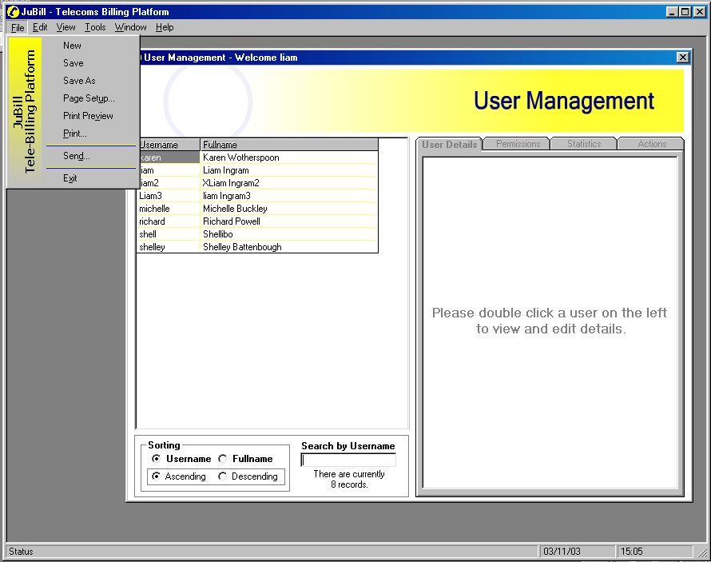



## User management with access

### Description

Create/edit users for your app, set and build permissions. Shows use of modular functions, databases, flexgrids and simple effective use of flash.

Thanks to LaVolpe for his excellent menu system!

This is my first post to PSC (or a website of its kind), only been programming for 10 months. This is the very beginning of a Telecoms Billing Platform, and will be converted to SQL soon.

The main form contains a flexgrid and a set of tabs full of controls, the form uses functions in a module to populate the form with data and for it to use the right controls in tha tabs. This means the same form can be and will be used for many different data entities, not just for the business's User management, but the customers, salesforce, bills, accounts, customer services and telecoms technical titbits.

All comments, ideas, modifications, are well

appreciated.

Thanks
 
### More Info
 

             |
---                |---
**Submitted On**   |2003-11-03 15:09:44
**By**             |[Liam Ingram](https://github.com/Planet-Source-Code/PSCIndex/blob/master/ByAuthor/liam-ingram.md)
**Level**          |Intermediate
**User Rating**    |4.5 (36 globes from 8 users)
**Compatibility**  |VB 6\.0
**Category**       |[Complete Applications](https://github.com/Planet-Source-Code/PSCIndex/blob/master/ByCategory/complete-applications__1-27.md)
**World**          |[Visual Basic](https://github.com/Planet-Source-Code/PSCIndex/blob/master/ByWorld/visual-basic.md)
**Archive File**   |[User\_manag16764411262003\.zip](https://github.com/Planet-Source-Code/liam-ingram-user-management-with-access__1-50137/archive/master.zip)

